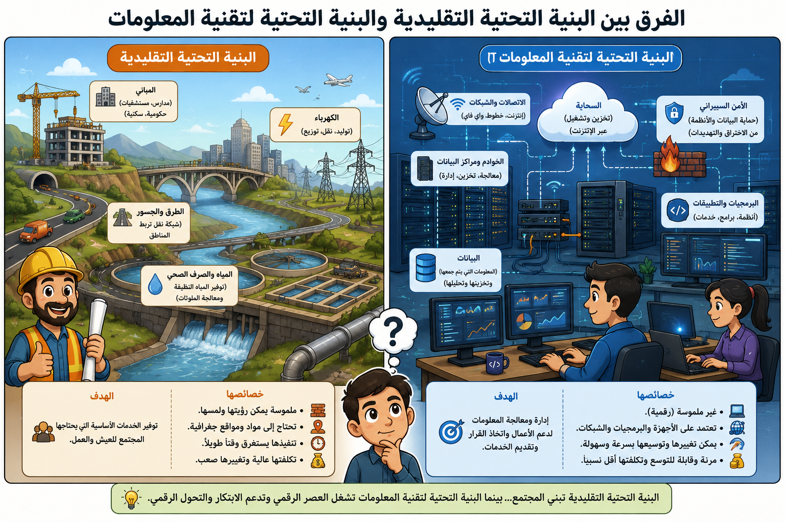

# الصفحة 2: مقدمة الوحدة وأساسيات البنية التحتية

## نظرة عامة

تعتمد حياتنا اليومية بشكل متزايد على تكنولوجيا المعلومات (IT) لأداء أبسط المهام. تهدف هذه الوحدة إلى استكشاف كيف تلبي البنية التحتية لتكنولوجيا المعلومات احتياجات المؤسسات وأصحاب المصلحة.

## المفاهيم الأساسية

- **البنية التحتية (Infrastructure):** تشير إلى المرافق والخدمات الأساسية التي تحتاجها المؤسسة لمزاولة أعمالها (مثل الكهرباء، المياه، الصرف الصحي، والنقل).
- **البنية التحتية لتكنولوجيا المعلومات:** تشمل الأنظمة، الأجهزة، البرامج، الشبكات، والموظفين المدربين اللازمين لتشغيل وإدارة بيئة تكنولوجيا المعلومات.
- **أصحاب المصلحة (Stakeholders):** أي شخص لديه اهتمام أو مصلحة مالية في عمل الشركة، وينقسمون إلى:
  - **داخليون:** مثل الموظفين والمدراء.
  - **خارجيون:** مثل العملاء والموردين.

## أهداف التعلم

1. اكتشاف كيفية تلبية البنية التحتية لتكنولوجيا المعلومات لاحتياجات المؤسسات.
2. فهم كيفية استفادة المؤسسات من البيانات والمعلومات.
3. وضع سياسات استخدام تكنولوجيا المعلومات داخل المؤسسة.

## مصطلحات رئيسية

- **الاستعانة بمصادر خارجية (Outsourcing):** تعيين متخصصين من خارج الشركة لتنفيذ وظائف معينة (مثل المحاسبة أو إدارة أنظمة IT).
- **النفقات العامة (Overheads):** التكاليف التي تتكبدها المؤسسات لتوظيف الموظفين والمباني والمعدات.
- **الإجراءات (Procedures):** خطوات منظمة تتبعها المنظمة لضمان ثبات وتوحيد العمل.
- **السياسات (Policies):** القواعد التي يجب على الأفراد والمؤسسات الالتزام بها (مثل القيود المفروضة على الإفصاح عن المعلومات الحساسة).

## 

## شركة الحكمة للأدوية (Hikma Pharmaceuticals)

**السياق**: شركة أدوية أردنية متعددة الجنسيات، وتُعد قصة نجاح أردنية بارزة على المستوى الإقليمي والعالمي .

**تأثير البنية التحتية لـ IT**: اعتمدت "الحكمة" على بنية تحتية قوية ومتكاملة لتكنولوجيا المعلومات لربط عملياتها المعقدة عبر سلاسل التوريد العالمية، ومراكز البحث والتطوير، والمرافق التصنيعية. هذا التكامل الرقمي مكّن الشركة من تحسين إدارة البيانات الضخمة، ورفع الكفاءة التشغيلية، ودعم توسعها المستمر، مما ساهم في توظيف أكثر من 9,500 موظف عالمياً والحفاظ على مكانتها كقائد في قطاع الرعاية الصح
