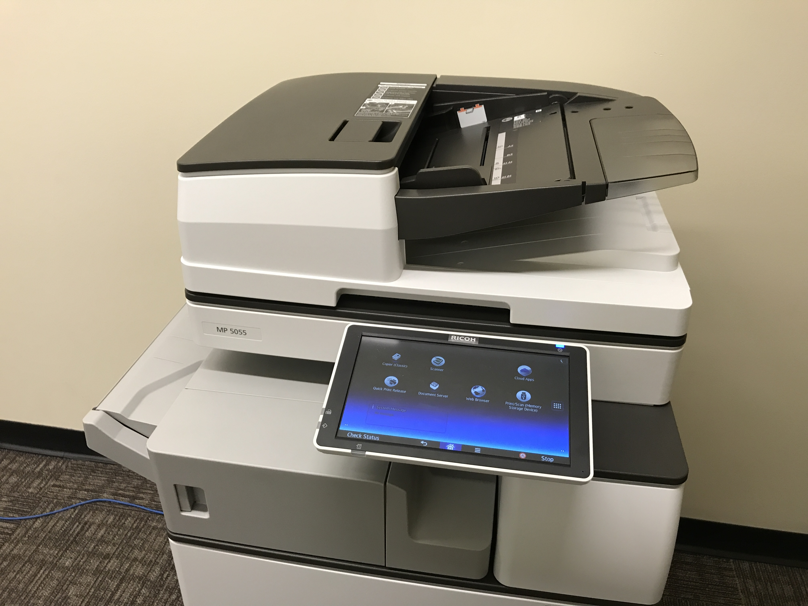
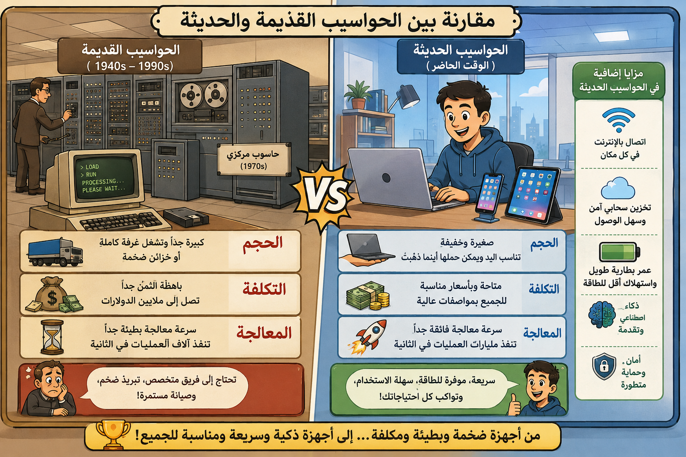

# الأجهزة الرقمية ومتعددة الوظائف

## الأجهزة الرقمية في حياتنا اليومية

أصبحت أجهزة تكنولوجيا المعلومات معقدة وسريعة، وتعتمد عليها الشركات لفترات طويلة. نحن ندرك أن الحواسيب تعتمد عليها، لكننا لا ندرك أن العديد من الأشياء اليومية تعتمد على أجهزة رقمية لتشغيلها، مثل:

- السيارات
- الطائرات
- الغسالات
- الثلاجات
- السلالم الكهربائية
- وأنظمة التدفئة والإضاءة

## الأجهزة متعددة الوظائف (MFD / AIO)

تُعرف أيضاً باسم **الكل في واحد (All-in-One)**، وهي أجهزة تقوم بوظائف متعددة بعدة أغراض:

- لا تقوم بالطباعة فحسب، بل تجري عمليات المسح الضوئي، النسخ، وإرسال الفاكس والبريد الإلكتروني.

## الحواسيب الشخصية (Desktop & Laptop)

- **التطور التاريخي:** في أواخر السبعينيات، كانت الحواسيب عبارة عن قطع كبيرة تحتاج لغرف كاملة.
- **الوضع الحالي:** تطورت التكنولوجيا بسرعة لدرجة أننا نتوقع الآن أن تكون الأجهزة أصغر وأخف وزناً (أجهزة اللابتوب والدفترية).
- تجمع الحواسيب الحديثة بين مجموعة متعددة من الوظائف الرقمية وإدارة حياتنا اليومية.

