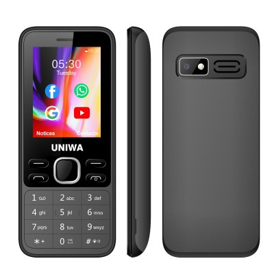
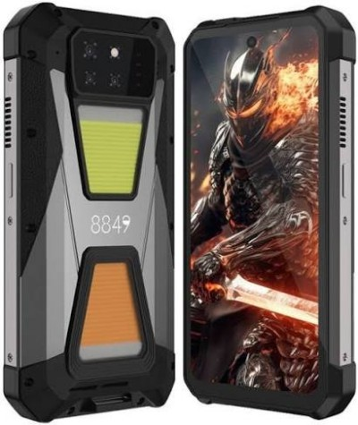
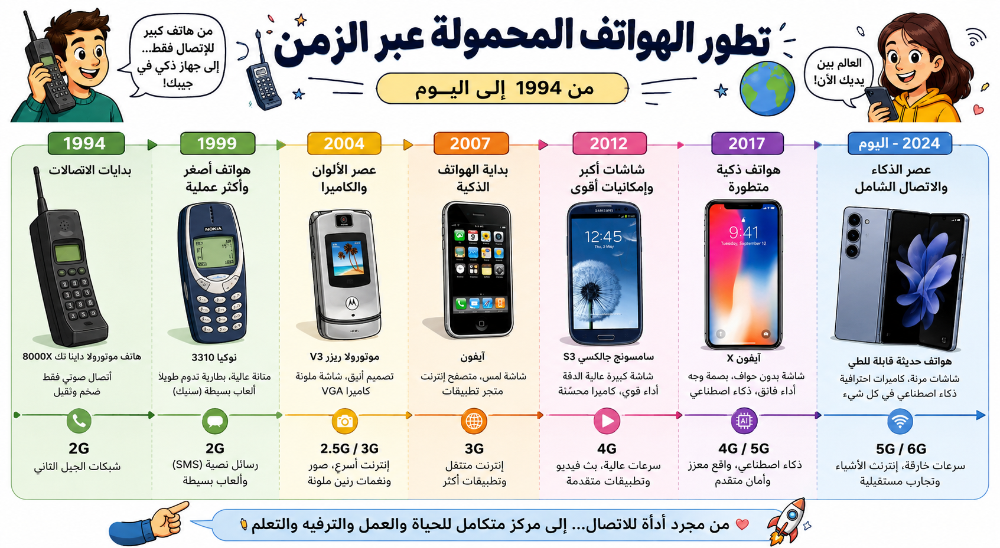

# الأجهزة المحمولة والهواتف الذكية

## الأجهزة المحمولة (Mobile Devices)

يُطلق مصطلح الجهاز المحمول على أي جهاز رقمي يمكن حمله بسهولة، مزود بتقنيات الاتصال (مثل Wi-Fi)، ويزن عادة أقل من 150 جراماً.

- **أمثلة:** الهواتف الذكية، الأجهزة اللوحية، أجهزة قراءة الكتب الإلكترونية، والحواسيب المحمولة القابلة للطي.

## الهواتف الذكية (Smartphones)

- ظهرت أول هواتف ذكية للعرض العام في عام 1994 (مثل IBM Simon).
- مع ظهور شاشات اللمس والبريد الإلكتروني، أصبحت عنصراً شخصياً لا غنى عنه للتنقل والبقاء على اتصال.
- توفر الوصول الفوري إلى الإنترنت والبريد الإلكتروني في راحة يدك.

## الهواتف القياسية (Feature Phones)

- كما يوحي اسمها، تهدف إلى تقليل النفايات الإلكترونية ("عالم الزبالة") وتقليل تكاليف الإصلاح.
- تتميز بمكونات يمكن استبدالها بسهولة، ومصممة لتكون أكثر راحة في الاستخدام.
- تم إنتاج نماذج منها بواسطة شركات مثل Fairphone و Motorola.

## الهواتف المتخصصة (Specialized Phones)

صُممت لمساعدة الأشخاص ذوي الاحتياجات الخاصة أو الذين يعملون في ظروف قاسية:

- **لكبار السن أو ضعاف البصر:** أزرار كبيرة ومفاتيح واضحة.
- **للظروف القاسية:** مقاومة للمياه، الحرارة، البرودة الشديدة، أو الأماكن التي تتطلب نظافة عالية.

---

## 💡 خط زمني يوضح تطور الهواتف المحمولة من عام 1994 حتى يومنا هذا.

