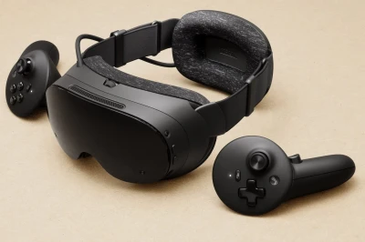
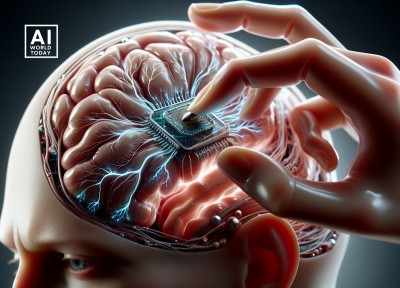

# الأجهزة اللوحية والمحمولة والقابلة للارتداء

## الأجهزة اللوحية (Tablets)

- وصلت أول أجهزة لوحية من مايكروسوفت في عام 2000 كمطور للجهاز المساعد الرقمي الشخصي (PDA).
- تطورت لتصبح أصغر حجماً وشائعة الاستخدام لأغراض متعددة.
- مع ظهور التسوق والتصفح عبر الإنترنت، أصبحت الأجهزة اللوحية والحواسيب المحمولة هي الخيار المفضل للمستخدمين الذين ينتجون جداول البيانات والبرامج المكتبية.

## الحواسيب المحمولة (Laptops)

- تُختار غالباً للاستخدام المنزلي كبديل للحواسيب المكتبية لقابليتها للنقل وتوفير المساحة.
- **في المؤسسات:** يفضلها الموظفون الذين يعملون عن بُعد أو في مواقع مختلفة.
- تسمح بالوصول إلى البيانات المخزنة على الخوادم المركزية عبر الإنترنت.

## الأجهزة القابلة للارتداء (Wearable Computers)

تشمل مجموعة من الأجهزة المحمولة مثل الساعات الذكية ونظارات Google Glass وأجهزة تتبع اللياقة البدنية.

- **المميزات:** القدرة على معالجة البيانات وتخزينها، ومصممة لسهولة الوصول والراحة.
- **الاستخدامات المتخصصة:**
  - **الواقع الافتراضي (VR) والواقع المعزز (AR):** في التعليم والتدريب.
  - **الرعاية الصحية:** مراقبة صحة المريض ومعدل ضربات القلب.
  - **الأمن:** ترتديها قوات الشرطة كاميرات مثبتة على الجسم لجمع الأدلة.
- **الأجهزة المزروعة:** يمكن زرع أجهزة طبية حيوية مزروعة أو أدوات قابلة للزرع في الدماغ أو الجسم.

---

## 💡فكر

- **اعتبارات أخلاقية:** خصوصية البيانات عند استخدام الكاميرات المثبتة على الجسم أو الأجهزة المزروعة.

زراعة شريحة إلكترونية في الدماغ (neuralinks - elon musk)

