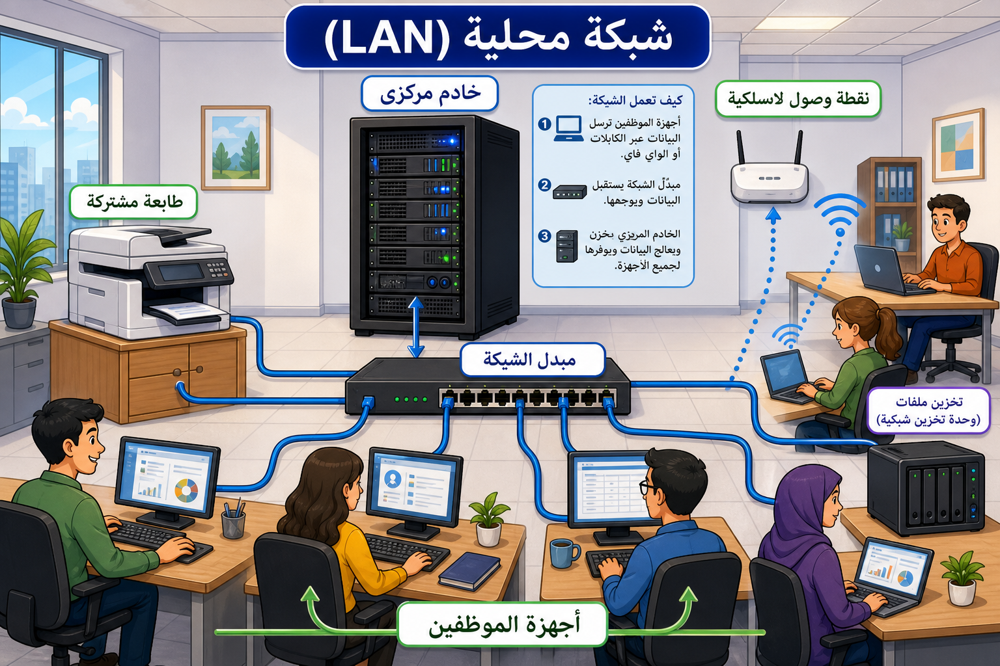

# الخوادم وأنظمة الترفيه والكاميرات

## الخوادم (Servers)

- أجهزة حاسوب قوية توفر خدمات الشبكة، تطبيقات الشبكة، والتخزين.
- **الشبكات المحلية (LAN):** تربط الخادم بالحواسيب الأخرى عبر الكابلات.
- **الوظائف:** التخزين المركزي لملفات البيانات، تخزين البرامج المركزية لتخفيف مساحة التخزين على الأجهزة الفردية، والسماح بالوصول المشترك للأجهزة (مثل الطابعات).
- **الحوسبة السحابية (Cloud Computing):** مصطلح يُستخدم للإشارة إلى الخوادم المنفصلة جغرافياً والتي توفر خدمات التخزين عبر الإنترنت.

## أنظمة الترفيه (Entertainment Systems)

- تشمل الصوت والرؤية، وتدير ملفات الموسيقى والفيديو.
- يمكن تشغيلها من خادم وسائط رقمي مركزي لتقليل السعة المطلوبة على الحواسيب الشخصية.
- **أمثلة:** التلفزيونات، أجهزة العرض، مشغلات DVD و Blu-ray، أنظمة الصوت، ومحطات الوسائط.
- **التلفزيونات الذكية:** تُعرف بأنها أنظمة ترفيه بالإضافة إلى كونها أجهزة حاسوبية ولوحية.

## الكاميرات الرقمية (Digital Cameras)

تلتقط نوعين من الصور:

1. **الثابتة:** لا تتحرك، وتشغل مساحة تخزين أقل بكثير.
2. **الفيديو:** تتكون من سلسلة من الإطارات، ويمكن التقاط إطارات مفردة منها كصور ثابتة.

- **الدقة:** تقاس بالبكسل (مربعات صغيرة)، وقد تحتوي الصورة عالية الدقة على عدة ملايين من البكسل (ميجابكسل).
- **أنواع الكاميرات:** كاميرات SLR (عاكسة أحادية العدسة) وكاميرات DSLR الرقمية التي تحظى بشعبية في التصوير المتخصص بسبب جودة الصورة وقابلية تغيير العدسات.

---

## 💡 فكر

كيف يؤثر "الميجابكسل" على **حجم الصورة** و **جودتها**
