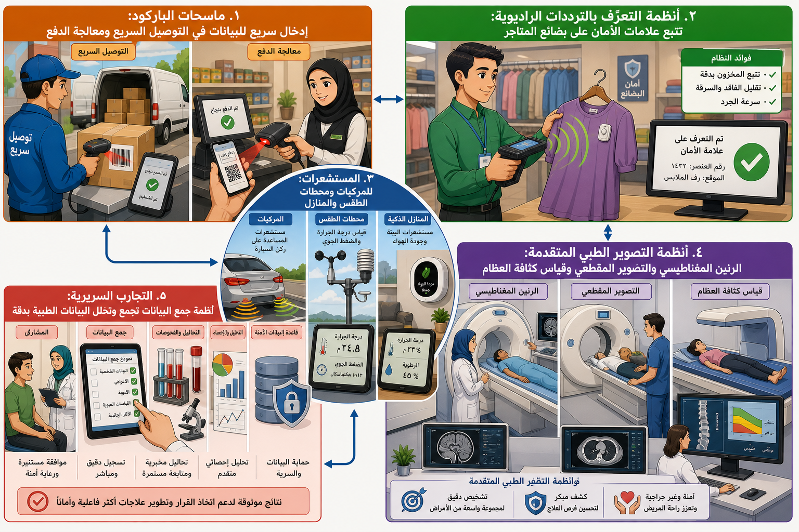

# أنظمة الملاحة وجمع البيانات

## أنظمة الملاحة (Navigation Systems)

تستخدم نظام تحديد المواقع العالمي (GPS) أو النظام العالمي للملاحة بالأقمار الصناعية (GLONASS) للانتقال عبر المواقع.

- **المعلومات المقدمة:** الازدحام المروري، أعمال الطرق، الحوادث، الطقس، ونقاط الاهتمام.
- **الأشكال:** أجهزة مستقلة (مثل Garmin و TomTom)، أنظمة مدمجة في السيارات والدراجات النارية، أو تطبيقات مدمجة في الهواتف الذكية.

## أنظمة تسجيل وجمع البيانات (EDC)

تُستخدم لأداء مهام محددة وجمع المعلومات لأغراض التحليل.

- **أمثلة شائعة:**
  - **ماسحات الباركود:** لإدخال البيانات بسرعة في خدمات البريد السريع وعمليات الدفع.
  - **نظام تحديد الهوية بتردد الراديو (RFID):** لتتبع علامات الأمان على البضائع في بيع التجزئة.
  - **أجهزة الاستشعار (Sensors):** في السيارات (للمساعدة في ركن السيارة)، محطات الطقس (لقياس الحرارة والضغط)، والمنازل.
- **الأنظمة الرائدة في المسح الطبي:** التصوير بالرنين المغناطيسي (MRI)، التصوير المقطعي (CT)، وقياس امتصاص الأشعة السينية (DEXA).
- **التجارب السريرية:** تُستخدم أنظمة جمع البيانات لجمع وتحليل البيانات الطبية بدقة.

