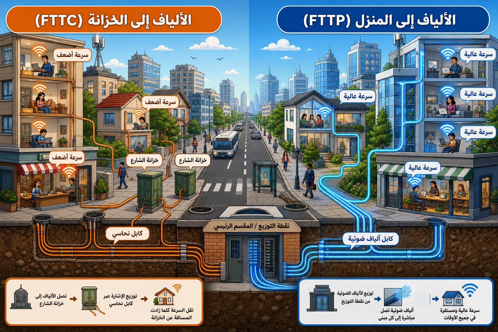

# أنظمة الاتصالات واستخدامات التكنولوجيا

## أنظمة وأجهزة الاتصالات

أدت الطلبات المتزايدة على التفاعل بين الأجهزة الرقمية والحوسبة السحابية إلى وجود اتصالات عالمية مرنة.

- **الأقمار الصناعية:** كابلات دون استخدام أسلاك، مخصصة للمناطق النائية التي لا يتوفر فيها النطاق العريض.
- **واي فاي (Wi-Fi / IEEE 802.11):** بروتوكول لاسلكي يربط الأجهزة باستخدام موجات راديو عالية التردد.
- **الألياف البصرية:**
  - **FTTC (الألياف إلى الخزانة):** توفر نطاقاً عريضاً، وجزء الاتصال بالمبنى هو النحاس التقليدي.
  - **FTTP (الألياف إلى المبنى):** توفر نطاقاً عريضاً أسرع من FTTC.
- **شبكات البيانات المتنقلة (4G/LTE/5G):** سرعات عالية تصل إلى 50 ميجابايت في الثانية.
- **البلوتوث (Bluetooth):** لشبكات المنطقة الشخصية (PANs) لربط الأجهزة الطرفية القريبة.

## مصطلحات الاتصالات

- **النطاق العريض (Broadband):** تقنية إرسال رسائل عالية السرعة، تشمل DSL, Wi-Fi, 3G, 4G, 5G.
  - يربط منزلك بمزود خدمة الإنترنت باستخدام كابل, أو خط ألياف ضوئية، أو عبر الأقمار الصناعية.
- **السرعة (Mbps):** ميجابايت في الثانية، لقياس سرعة التحميل والتنزيل.

## استخدام التكنولوجيا في التعليم

- استخدام الوسائط الرقمية للوصول إلى الكتب والمعلمين الافتراضيين.
- تفاعل المتعلمين مع المواد الدراسية مما يسهل فهم المفاهيم.

## 💡نشاط

- **نشاط عملي:** قياس سرعة الإنترنت (Speed Test) ومقارنتها بوحدات Mbps و MB/s المذكورة في النص.
