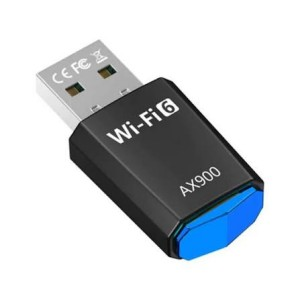

# الأجهزة الطرفية: أجهزة الإدخال

## ما هي الأجهزة الطرفية؟

الجهاز الطرفي هو جهاز إضافي (تكميلي) للحاسوب، يمكن لمسه وتشكيل جزء من نظام تكنولوجيا المعلومات.

- **أنواعها:** أجهزة إدخال، إخراج، تخزين، واتصال.

## أجهزة الإدخال (Input Devices)

تتفاعل مع المعلومات أو ترسل البيانات إلى جهاز الحاسوب (ولا تعمل على تخزين البيانات).

1. **لوحات المفاتيح:** لإدخال البيانات أو نقل التعليمات.
2. **شاشات اللمس:** تتيح إجراء العمليات بالسحب والإفلات دون استخدام الفأرة.
3. **أجهزة التأشير:** الفأرة (للتحديد)، الأقلام الضوئية (للرسم والتحرير بدقة على شاشات اللمس)، ولوحات اللمس (Touchpads) في اللابتوب.
4. **أقراص الرسم (Graphics Tablets):** تتيح رسم الصور يدوياً وتتبعها كما لو كنت تستخدم الورق والقلم.
5. **الميكروفونات:** للتواصل الصوتي أو تسجيل الصوت (مدمجة غالباً في اللابتوب والهواتف).
6. **الماسحات الضوئية (Scanners):** تستخدم الضوء لعمل نسخ رقمية من المستندات (ثنائية الأبعاد) أو مسح الأجسام (ثلاثية الأبعاد).
7. **الكاميرات وأجهزة الاستشعار:** التقاط الصور والفيديو، أو إدخال بيانات البيئة المادية (الحرارة، الحركة، الغاز، الرطوبة).
8. **كاميرات الويب:** لنقل الصور المتحركة عبر الإنترنت للتواصل المرئي.

## أنواع الاتصال الشائعة

- **USB:** الناقل التسلسلي العالمي، لتوصيل العديد من الأجهزة الطرفية ومحركات التخزين.
- **Dongles:** أجهزة صغيرة مثل محولات Wi-Fi أو البلوتوث توصل بمنفذ USB لإضافة قدرات لاسلكية.

