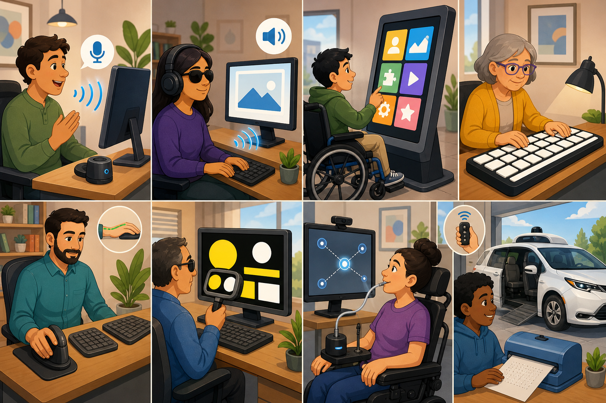

# تكنولوجيا الوصول والمعالجة اليدوية

## أجهزة إمكانية الوصول (Accessibility / Adaptive Tech)

توفر خيارات بديلة للإدخال والإخراج عندما لا تكون الطرق القياسية خياراً بسبب الإعاقات الجسدية:

- **برامج التعرف على الصوت:** تتيح التحكم بإعطاء تعليمات صوتية (مفيد لمن لديهم إعاقة جسدية في اليدين).
- **قارئات الشاشة:** تقرأ الكلمات والمعروضات بصوت عالٍ، وتقرأ "النص البديل" للصور (للمكفوفين).
- **شاشات اللمس:** طريقة تفاعلية وسهلة لمن لا يستطيع استخدام لوحة المفاتيح.
- **لوحات المفاتيح كبيرة الحجم:** للأشخاص الذين يعانون من ضعف البصر أو صعوبات جسدية.
- **الفأرة ولوحة المفاتيح المريحة:** تفيد من يعانون من إجهاد متكرر (RSI).
- **مكبرات الشاشة وتباين الألوان:** لتسهيل القراءة لضعاف البصر أو من يعانون من عسر القراءة.
- **أنظمة تتبع العين والشفط والنفخ (Sip-and-puff):** لإتمام المهام لمن يعانون من شلل أو محدودية حركية شديدة.
- **طابعات برايل وسيارات بدون مفاتيح:** تمكّن المستخدمين من إخراج مستندات ملموسة أو القيادة بأمان.

## المعالجة اليدوية للبيانات

- تشمل إدخال تفاصيل العملاء، معالجة المبيعات يدوياً، وضع العلامات على النصوص، وتصحيح الاختبارات.
- **قاعدة "الدخول الخاطئ يعني الخروج الخاطئ" (Garbage In, Garbage Out):** الحاسوب لا يقلل من جودة ما يدخل إليه. الآلة الحاسبة البسيطة ستعطي إجابة صحيحة دائماً بناءً على الأرقام المدخلة، لكنها لن تعرف إذا كانت الأرقام نفسها خاطئة. الحاسوب لا يملك قدرة اتخاذ القرار إلا بما بُرمج عليه.
