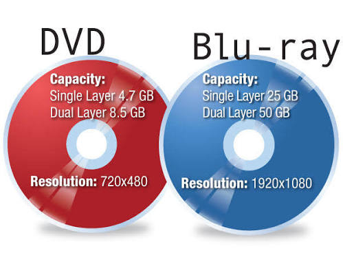

# تقنيات التخزين المتقدمة و RAID

## تطور وسائط التخزين المغناطيسي والصلب

- **الأقراص المغناطيسية (بما فيها الأشرطة المرنة):** تطورت بشكل كبير منذ أيام الأقراص المرنة، مما أدى إلى زيادة هائلة في سعة التخزين وانخفاض التكلفة. ومع ذلك، تفتقر إلى المتانة مقارنة بالبدائل، لكنها قابلة لإعادة الاستخدام والنسخ الاحتياطي دون انقطاع.
- **أقراص الحالة الصلبة (SSD):**
  - تحتوي على عدد أقل من الأجزاء المتحركة مقارنة بمحركات الأقراص التقليدية.
  - **المميزات:** أسرع بكثير، أخف وزناً، وأقل احتمالاً للتلف في حالة السقوط.
  - **العيوب:** عمرها الافتراضي أقصر، سعة تخزين محدودة، وتكلفتها أعلى من البدائل.

## الأقراص الضوئية

- سريعة وتقلل التكلفة إلى حد ما عند مقارنتها بالأقراص الصلبة، لكنها تتمتع بسعة تخزين محدودة (باستثناء أقراص Blu-ray التي تستخدم أطوالاً موجية ومواد مختلفة لزيادة السعة).

## الخلاصة

تختلف احتياجات التخزين بناءً على:

1. **السعة المطلوبة** (أرشفة طويلة الأمد vs الوصول السريع).
2. **التكلفة**.
3. **المتانة ومقاومة الصدمات** (خاصة في الأجهزة المحمولة).
4. **السرعة** (ضرورية للخوادم وقواعد البيانات الكبيرة).

