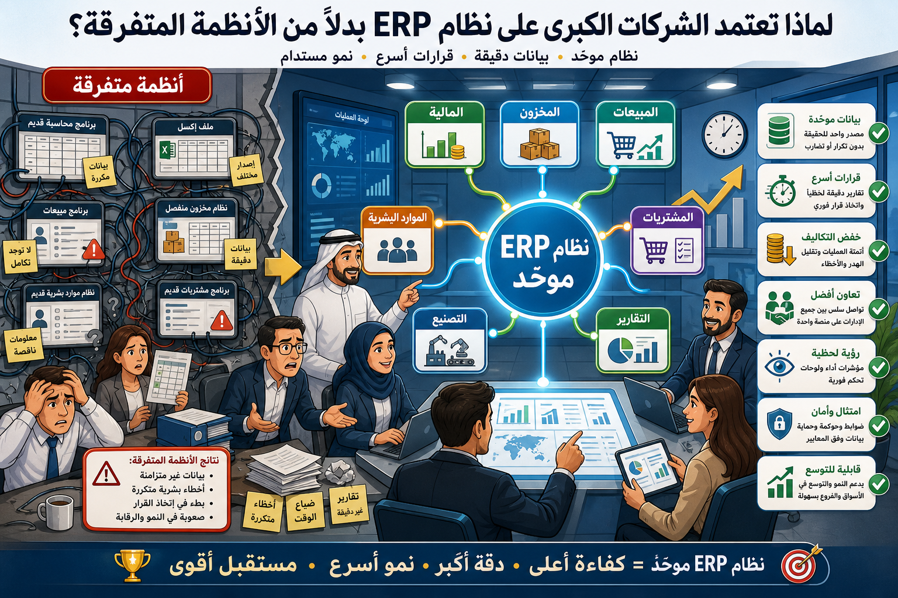

# البرامج التطبيقية ومصادر البرمجيات

## البرامج التطبيقية (Application Software)

هي البرامج المطلوبة لتشغيل تطبيقاتك وتسهيل الوصول إليها على الأجهزة الرقمية والهواتف الذكية.

## أمثلة على البرامج التطبيقية

- **الاتصالات:** Skype, FaceTime, WhatsApp.
- **التصميم بمساعدة الحاسوب (CAD):** يستخدم في الرسم الفني والتصميم المعماري.
- **أنظمة إدارة قواعد البيانات (DBMS):** لاستيراد البيانات وإدارتها.
- **الرسومات والرسوم المتحركة:** إنتاج تصاميم رقمية متكاملة.
- **تخطيط موارد المؤسسات (ERP):** إدارة عمليات الشراء، المبيعات، والمخزون.
- **الترفيه:** بث الموسيقى، الألعاب، ومشاهدة الأفلام.
- **حزم المكاتب:** مثل Microsoft Office و Apple iWork (Pages, Numbers, Keynote).

## برامج البرمجة

إذا كنت تدرس برمجة الحاسوب، فستصبح على دراية بلغات مثل **_Rust_**, Dart, Sql, Typescript, Kotlin, Python, و Java لإنتاج تطبيقات مخصصة.

## المصادر المفتوحة والمملوكة

- **الكود المملوك (Proprietary):** مثل أنظمة Microsoft و Apple، حيث يتم الاحتفاظ بالكود المصدري سرياً لمنع النسخ والتعديل.
- **الكود مفتوح المصدر (Open Source):** مثل HTML و Linux، حيث يمكن لأي شخص تعديل الكود وتحسينه بشكل تعاوني.

