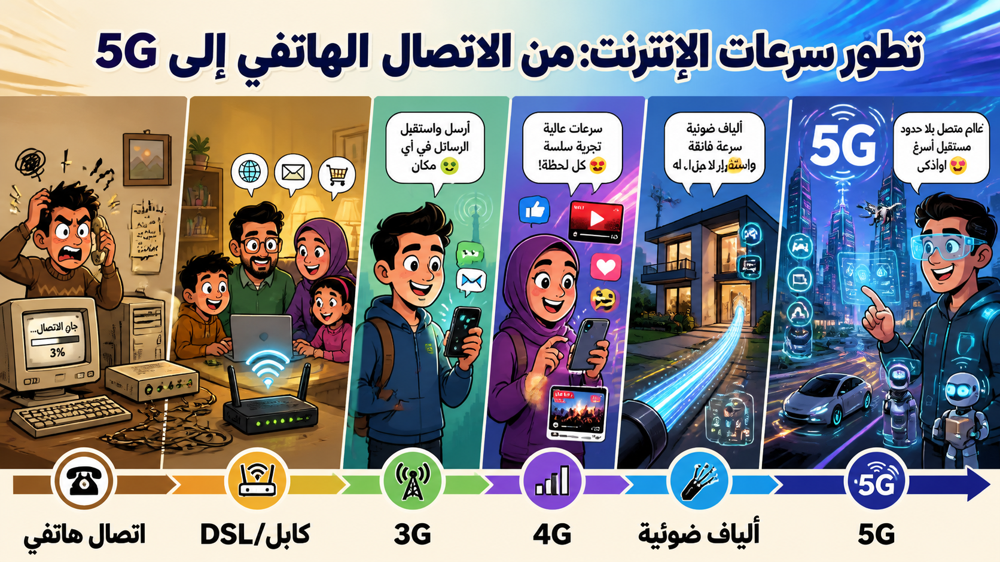

# تطور الاتصالات والمنازل الذكية

## التطور التاريخي للاتصالات

- **التحكم عن بعد:** بدأت باستخدام إشارات الراديو اللاسلكية في الجيش، ثم انتقلت إلى أجهزة التلفزيون باستخدام الأشعة تحت الحمراء (IR).
- **الإنترنت:** كان الاعتماد في البداية على خطوط الهاتف (Dial-up) التي كانت بطيئة ومزعجة، مما حد من حجم البيانات المنزلة. ساعد انتشار النطاق العريض (Broadband) على تحسين السرعات بشكل كبير.

## المنازل الذكية وإنترنت الأشياء (IoT)

نتمتع الآن بإمكانية الوصول إلى العديد من الأجهزة الرقمية المتصلة بالإنترنت، مما يتيح لنا:

- التحكم في الإضاءة والتدفئة تلقائياً أو عن بُعد.
- تغيير قنوات التلفزيون وإعدادات الأجهزة عبر التطبيقات.
- مراقبة أداء السيارات (مثل Mercedes) حيث تُرسل البيانات إلى المصنع للتشخيص والصيانة الوقائية.

## الفجوة الرقمية

رغم انتشار النطاق العريض، لا تزال بعض المناطق تفتقر إلى البنية التحتية أو القدرة المالية على تحمل تكاليفه، مما يخلق فجوة رقمية بين من يملكون الوصول للإنترنت ومن لا يملكونه.

