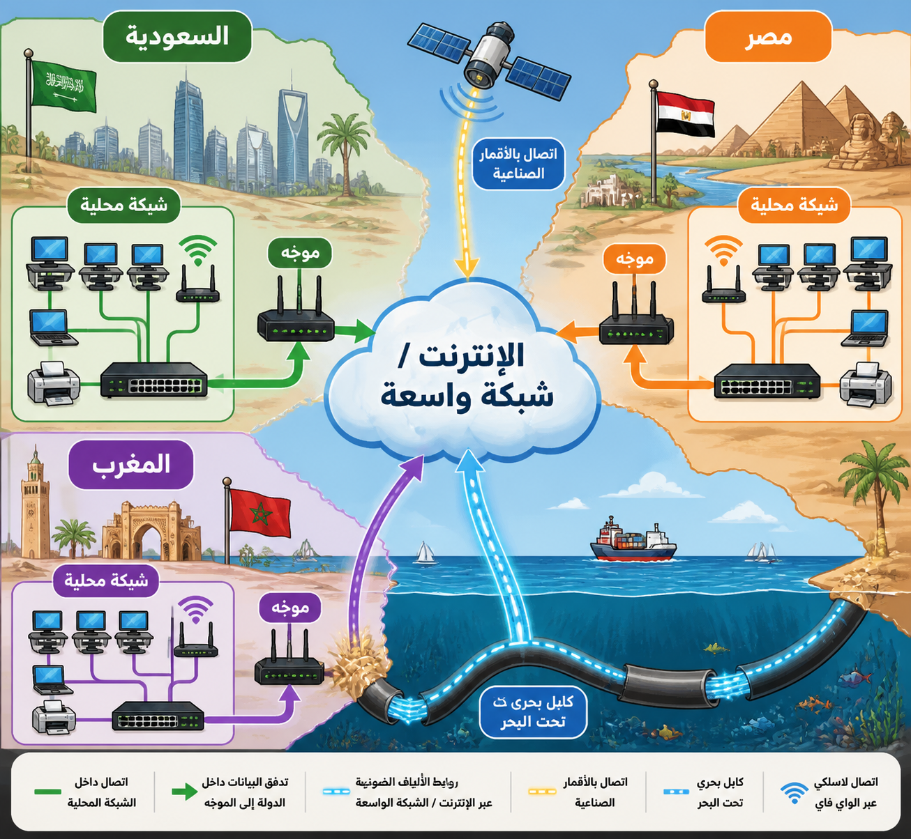

# أنواع الشبكات واستخداماتها

## تصنيف الشبكات حسب النطاق الجغرافي

1. **شبكة المنطقة الشخصية (PAN):** شبكة لاسلكية تربط الأجهزة الرقمية للفرد (مثل الهاتف، الحاسوب، والطابعة) لمزامنة البيانات.
2. **شبكة المنطقة المحلية (LAN):** توفر الاتصال بين الأجهزة داخل منطقة صغيرة (مثل مبنى أو مكتب). تمتلك المؤسسة البنية التحتية والكابلات.
3. **شبكة المنطقة الواسعة (WAN):** تستخدم كابلات الألياف البصرية والأقمار الصناعية لتوصيل الأجهزة عبر مناطق جغرافية واسعة. الإنترنت هو أكبر مثال على WAN.
4. **الشبكة الافتراضية الخاصة (VPN):** تستخدم الإنترنت لتوصيل الأجهزة البعيدة بشكل آمن، مما يتيح للموظفين العمل عن بُعد والوصول إلى شبكة الشركة.

## ملاحظة تاريخية

في الماضي، كانت شبكات WAN تُستخدم فقط لنقل الصوت، ولكنها الآن تنقل البيانات أيضاً باستخدام البنية التحتية للاتصالات السلكية واللاسلكية التي لا تمتلكها المؤسسة بالضرورة.

### رسم يوضح كيفية ارتباط شبكات LAN المتعددة لتشكيل WAN عبر دول مختلفة.

### كيف يقوم vpn بتأمين مرور البيانات وتشفيرها

