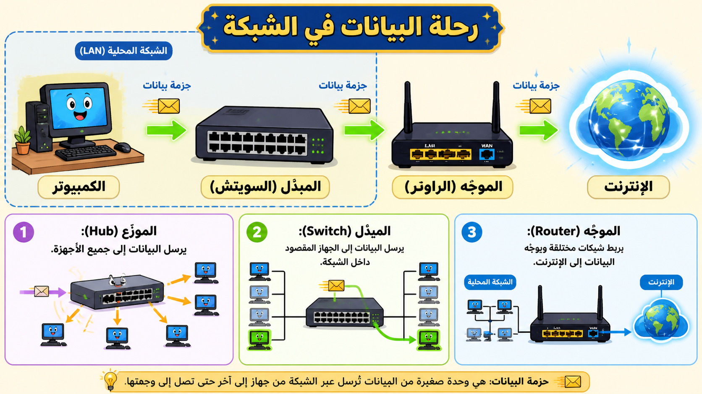

# الإنتاجية والأمان ومكونات الشبكة

## مكونات الشبكة وتأثيرها على الأداء

- **الموجه (Router):** يربط شبكات الحاسوب بالإنترنت. يعتمد أداؤه على المسافة من الخادم، وقد تتأثر إشارة Wi-Fi بالجدران والحواجز.
- **المبدل (Switch):** يعمل كصندوق توزيع يربط الأجهزة داخل المنزل أو المكتب. كلما زاد عدد الأجهزة المتصلة، زاد التأثير المحتمل على الأداء.
- **كابلات Ethernet:** توفر خياراً أكثر استقراراً من Wi-Fi للشبكات المحلية (LAN).
- **نقطة الوصول اللاسلكية (WAP):** توصل أجهزة Wi-Fi الأخرى بالشبكة، وتتأثر بعدد المستخدمين، التنزيلات، والظروف الجوية.

## مشكلات نقل البيانات

قد تواجه صعوبة في إرفاق الملفات بالبريد الإلكتروني بسبب قيود حجم الملفات التي يفرضها مزود الخدمة، أو بسبب مشكلات داخلية في الشبكة.

