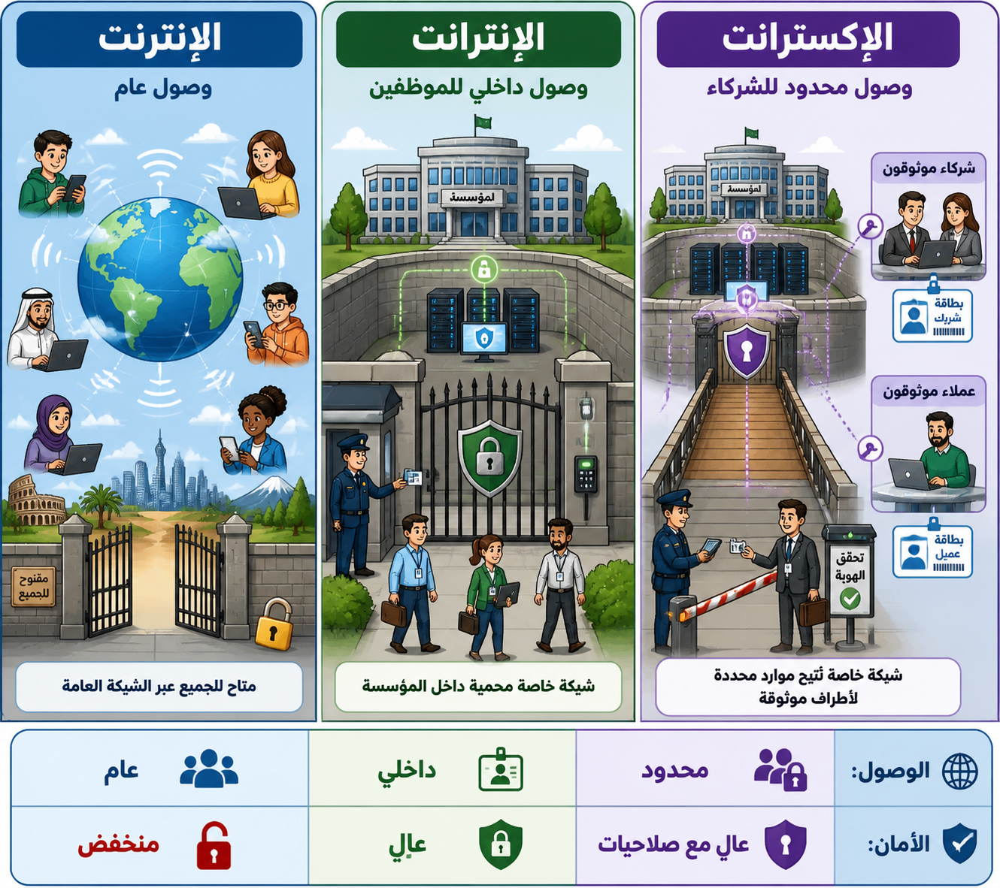

# الإنترانت والإكسترانت واحتياجات المستخدم

## المصطلحات الأساسية

- **الإنترانت (Intranet):** شبكة محلية إلكترونية يقتصر الوصول عليها المستخدمون الداخليون (مثل موظفي المؤسسة).
- **الإكسترانت (Extranet):** نظام إنترانت يسمح بالوصول من قبل مستخدمين خارجيين (مثل الموردين) مع الحفاظ على أمان البيانات.
- **وحدة المعالجة المركزية (CPU):** تشبه دماغ الحاسوب الذي يستخدمه لمعالجة التعليمات.

## احتياجات المستخدم والمواصفات

تختلف احتياجات الشبكة باختلاف الغرض منها:

- **الاستخدام المنزلي:** قد تحتاج العائلة إلى شبكة مشتركة لتلبية احتياجات الأفراد المتعددة.
- **الاستخدام التجاري:** تعتمد المواصفات على حجم النشاط التجاري وتوزيع الموظفين. الشركات ذات المكاتب المتعددة ستحتاج إلى مشاركة الملفات عبر الشبكة.
- **المواصفات التقنية:** تختلف سرعة الاتصال والسعة المطلوبة حسب نوع العمل (مثلاً، مكاتب التصميم الجرافيكي تتطلب مواصفات أعلى من المكاتب الإدارية).

### الفرق بين الإنترنت، الإنترانت، والإكسترانت من حيث الوصول والأمان

