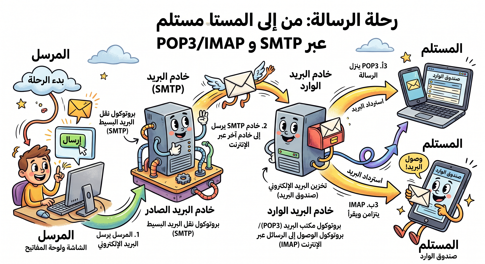

# نقل البيانات وبروتوكولات البريد الإلكتروني

## التشفير (Encryption)

هو تحويل البيانات إلى كود لتجنب الوصول إليها بسهولة من قبل غير المصرح لهم. يُستخدم برنامج متخصص لتشفير وفك تشفير البيانات.

## بروتوكولات البريد الإلكتروني

البروتوكولات هي مجموعة القواعد التي تتحكم في كيفية إجراء الاتصال. من أشهرها:

- **POP3:** يستخدم لاسترداد البريد من الخادم عبر عميل البريد (مثل Outlook).
- **SMTP:** لنقل البريد من عميل إلى خادم أو من خادم إلى آخر.
- **IMAP4:** للوصول إلى البريد على الخادم عن بُعد. الفرق الرئيسي بينه وبين POP3 هو أنه لا يزيل البريد من الخادم.
- **TCP/IP:** بروتوكول التحكم في الإرسال وبروتوكول الإنترنت. ينظم TCP البيانات لضمان النقل الآمن، بينما يحصل IP على عنوان التسليم.

## نقل الصوت والفيديو

- **VoIP:** نقل الصوت عبر بروتوكول الإنترنت، يتيح المكالمات الهاتفية عبر شبكة IP بدلاً من خطوط الهاتف القياسية.
- **RTP:** بروتوكول النقل في الوقت الفعلي، يُستخدم لبث الفيديو والمكالمات الصوتية.

