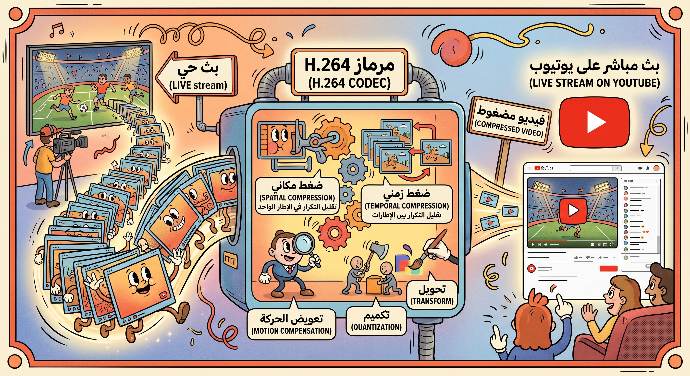

# الترميز (Codecs) وتقنياته

## ما هو برنامج الترميز (Codec)؟

هو جهاز أو برنامج يقوم بترميز (ضغط) تدفق البيانات الرقمية أو إشارتها، وفك تشفيرها (Decoding) عند الاستقبال.

- **الفرق عن الضغط:** نظام ضغط الصوت يختلف عن نظام ضغط الفيديو. تقوم برامج الترميز بضغط البيانات أحياناً، وأحياناً أخرى ترقمها فقط دون ضغط.

## تأثير برامج الترميز

- أحدثت ثورة في نقل الصوت والفيديو الرقمي مع الحفاظ على الجودة.
- تحسن الجودة عن طريق إزالة الأصوات غير الضرورية أو لحظات الصمت.
- تتيح للهواتف الذكية تخزين كميات هائلة من مقاطع الفيديو والموسيقى والصور بسعة تخزين أقل بكثير من حجمها الأصلي.

## التوافق (Compatibility)

- التأثير الرئيسي هو التأكد من أن المستقبل المقصود قادر على فك ترميز البيانات للاستماع إلى الصوت أو عرض الفيديو.
- إذا كان هناك خطأ في برنامج الترميز، قد لا يعمل الملف على بعض الأجهزة أو المنصات.

---

### كيف يعمل برنامج الترميز H.264 في ضغط الفيديو للبث المباشر على youtube

