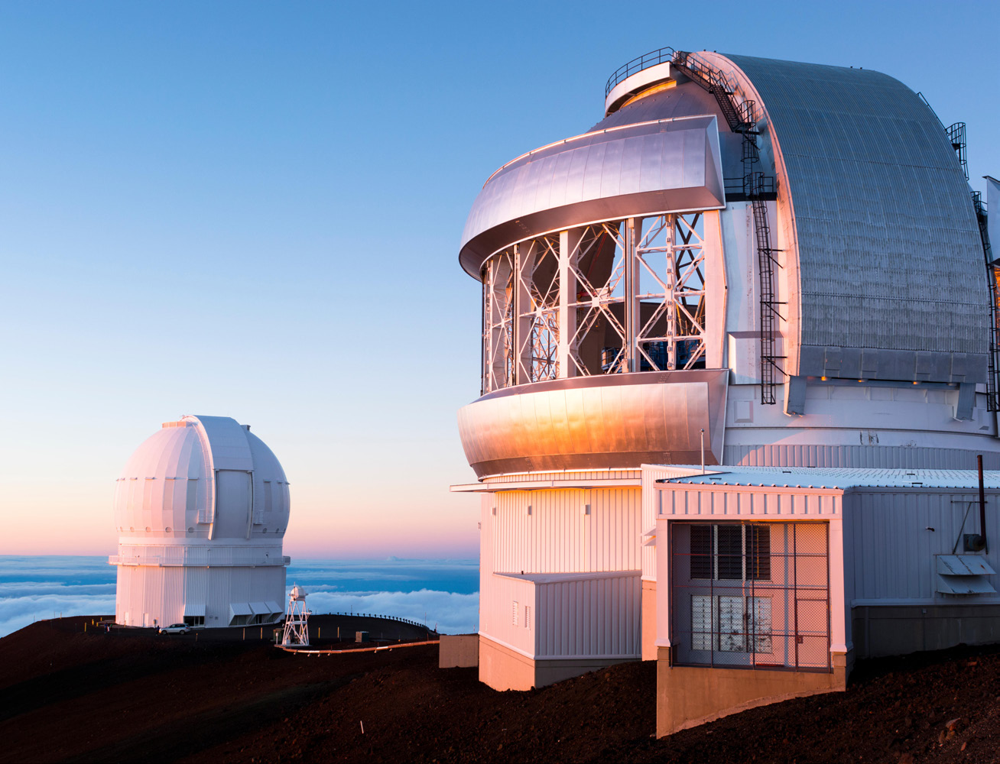

# التكنولوجيا الرقمية في علم الفلك

## دراسة حالة: التلسكوبات في mauna Kea

- يقع مرصد Mauna Kea في هاواي على ارتفاع 13,796 قدماً، وهو من أقوى وأكبر التلسكوبات في العالم.
- **سبب الموقع:** نقاء الهواء وخلو السماء من السحب يتيحان وصولاً أكبر لجمع البيانات الفلكية.
- **التحديات:** تتعرض التلسكوبات لظروف قاسية مثل الرياح القوية والثلوج.

## الاعتماد على التكنولوجيا الرقمية

- يجمع علماء الفلك البيانات مباشرة من خلال التلسكوبات كموجات ضوئية.
- تُنقل البيانات وتُحلل بواسطة أجهزة الحاسوب.
- **الأقمار الصناعية:** تتبع الأقمار الصناعية وتحديد مواقعها وحجمها وسرعتها.
- لا تقوم التلسكوبات عادة بتخزين البيانات، بل تعمل كواجهة لنقلها إلى أجهزة الحاسوب على الأرض.

## تلسكوب هابل (Hubble)

- أشهر تلسكوب في العالم، يدور حول الأرض منذ 1990.
- تم إصلاح مشكلة في مرآته عند إطلاقه الأول، مما أثر على وضوح الصور.
- ينقل هابل حوالي 140 جيجابايت من البيانات أسبوعياً.

