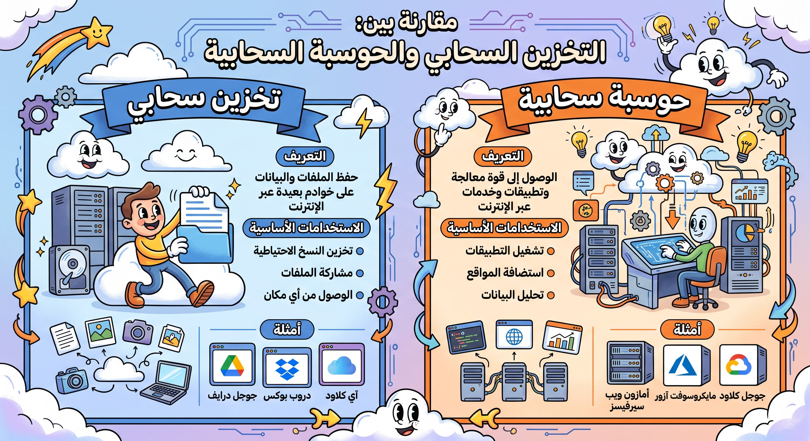

# الحوسبة السحابية واستخداماتها

## المفاهيم الأساسية

تُكمل **الحوسبة السحابية (Cloud Computing)** مفهوم التخزين السحابي، ولكنها تتجاوزه لتشغيل البرامج والموارد الحاسوبية نفسها عبر الإنترنت.

### تعريف الحوسبة السحابية

توفر الحوسبة السحابية الوصول إلى البرامج والمعلومات والموارد عبر خادم افتراضي. ويُشار إليها غالباً بأنها **"متاحة عند الطلب" (On-demand)**، مما يعني أن المستخدم لا يحتاج إلى تثبيت البرامج محلياً على جهازه.

### المتطلبات الأساسية

- **اتصال شبكي مناسب**: تعتمد الحوسبة السحابية بطبيعتها على وجود شبكة إنترنت مستقرة.
- **تطور شبكات الجيل الرابع والخامس (4G/5G)**: مع انتشار هذه الشبكات وتوفر نقاط اتصال **Wi-Fi**، أصبح بإمكان المزيد من الأشخاص تصفح الإنترنت، الدردشة، والوصول إلى ملفاتهم أثناء التنقل.

## التفكير والتطبيق (أنشطة تفاعلية)

- **سؤال للتفكير**: هل تستخدم التخزين السحابي؟ إذا كانت الإجابة "نعم"، فما هو الغرض من استخدامه وكيف تستخدمه؟
- **التطبيق النظري**: اشرح لشخص ليس لديه دراية تقنية (كأحد أفراد الأسرة) كيفية استخدام السحابة ومزاياها وعيوبها المحتملة. واختبر مدى وضوح تفسيرك لتطور صياغة التعليمات التقنية للمبتدئين.

---

### 💡 مقارنة بين “التخزين السحابي” و “الحوسبة السحابية” من حيث التعريف، الاستخدام الأساسي، والأمثلة

