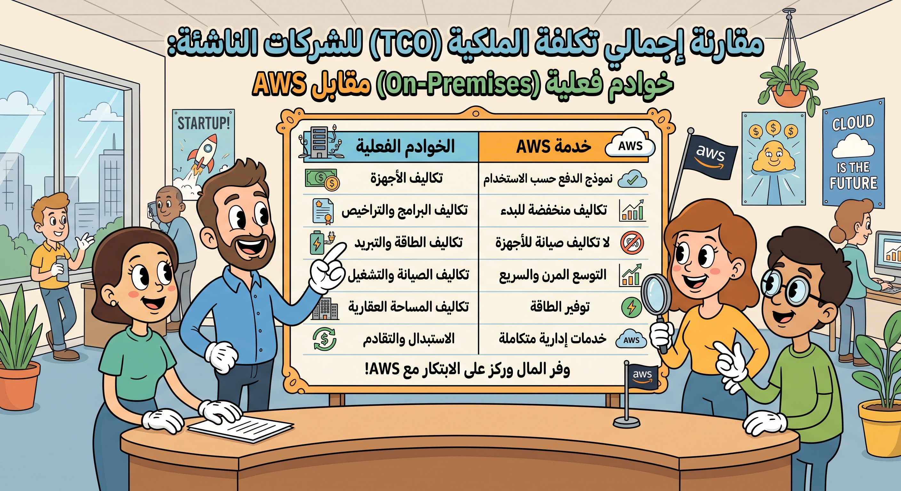

# التأثير الشخصي والمهني للحوسبة السحابية

## التأثير على الأفراد

- **توفير المال والمساحة**: تساهم الحوسبة السحابية في توفير الأموال وتحرير مساحة الأجهزة الرقمية، حيث لا يضطر الأفراد إلى شراء البرامج أو تنزيلها وتخزينها محلياً.
- **نموذج الاشتراك**: يدفع المستخدمون اشتراكات لاستخدام الموارد والبرامج التي يرغبون بها (مثل **Office 365**)، دون الحاجة لتحمل عناء التحديثات أو النسخ الاحتياطي، حيث يتولى المزود السحابي رعاية النظام على مدار الساعة.

## التأثير على المؤسسات والشركات

على الرغم من أن الخدمات السحابية قد تبدو مكلفة، إلا أنها تنطوي على تكلفة أقل بكثير من شراء التراخيص الفردية لكل موظف.

- **اقتصاديات الحجم (Economies of Scale)**: الشراء بكميات كبيرة عبر نموذج "ادفع كلما استخدمت" (Pay-as-you-go).
- **التوسع الديناميكي (Dynamic Scaling)**: استخدام خدمات مثل **Amazon Web Services (AWS)** أو **Microsoft Azure** يسمح للشركات بتوسيع قدرة الخوادم المتاحة ديناميكياً لتلبية حالات الذروة (مثل مبيعات الجمعة البيضاء) دون الخوف من فقدان المبيعات، ودفع تكلفة الطاقة المستخدمة فعلياً فقط.

## التعاون وإدارة المستندات

- **العمل المتزامن**: يمكن لأعضاء الفريق العمل على نفس المستند وتحديثه معاً في نفس الوقت، مما يحسن الإنتاجية ويتجنب الحاجة إلى إصدارات متعددة من نفس الملف.
- **تتبع التغييرات**: يمكن حفظ جميع التغييرات والرجوع إليها، مما يقلل من التناقضات.
- **العيوب المحتملة**: العمل بهذه الطريقة قد يعرض المستند للأخطاء حيث لا توجد سيطرة صارمة على التغييرات، وقد لا يمكن التراجع بسهولة عن التعديلات الكبيرة التي أجراها آخرون.

## فوائد ومخاطر الحوسبة السحابية للمؤسسات

### الفوائد:

- مرافق تخزين غير محدودة.
- تقليل التكاليف والحاجة إلى دعم تقني متخصص داخلي.
- تمكين أصحاب العمل من التركيز على أهداف العمل الأساسية بدلاً من إدارة البنية التحتية.
- تلبية احتياجات القوى العاملة بمرونة (مثل عقد الاجتماعات الافتراضية ومشاركة الملفات).

### المخاطر وإدارة السياسات:

يجب على المديرين مقارنة تكلفة السحابة مع تكلفة شراء وصيانة الخوادم الخاصة. كما يجب وضع سياسات واضحة تشمل:

1. استخدام السحابة للأغراض المهنية فقط.
2. خطط الطوارئ لحالات انقطاع الخدمة.
3. تحديد الوثائق التي **لا ينبغي** تخزينها على السحابة (مثل المستندات المالية والحكومية الحساسة).
4. توفير بدائل تخزين محلية للبيانات شديدة الحساسية.

### جدول يقارن التكلفة الإجمالية للملكية (TCO) بين شراء خوادم مادية (On-Premises) واستخدام AWS لشركة ناشئة.

### يوضح آلية "التوسع الديناميكي" (Auto-scaling) وكيف تستجيب السحابة تلقائياً للضغط المفاجئ في حركة المرور على موقع تجاري.

