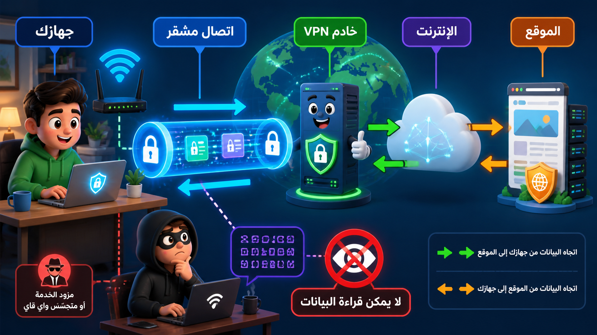

# الشبكات الخاصة الافتراضية (VPN)

## أنظمة تمكين العمل عن بُعد

### الشبكات الخاصة الافتراضية (VPN)

تتيح شبكات **VPN** للمستخدمين أن يكونوا جزءاً من شبكة المنطقة المحلية (LAN) للشركة بشكل "افتراضي" أثناء تواجدهم الفعلي في مكان بعيد.

- **كيف تعمل؟**: تنشئ نفقاً افتراضياً آمناً ومشفراً عبر الشبكة العامة (الإنترنت)، مما يضمن سلامة البيانات وثقة العميل.
- **أمثلة على مزودي VPN**: ExpressVPN، IPVanish، VyprVPN، CentreStack.
- **قيود الوصول**: إذا كان الجهاز يعمل بشكل افتراضي دون اتصال فعلي بالإنترنت أو إعدادات خاصة، فلن يتمكن من عرض الملفات العامة إلا إذا تم تكوين الإعدادات للسماح بالاتصال السحابي الآمن.

