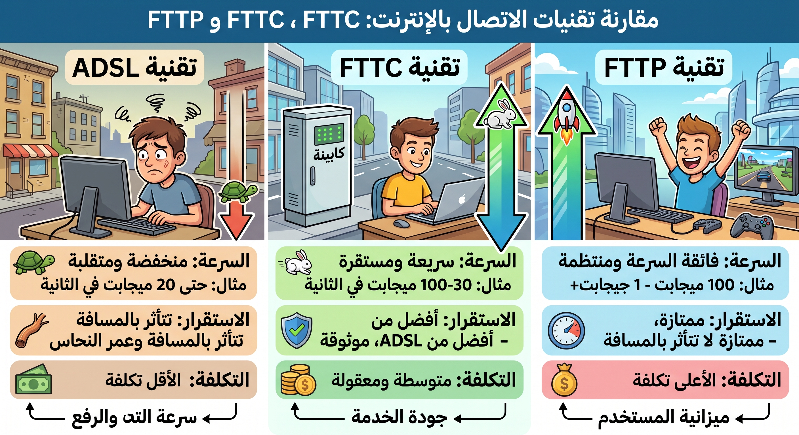

# سهولة الاستخدام، الميزات، وإمكانية الاتصال

## 3. سهولة الاستخدام (Usability)

تعني إمكانية الوصول إلى الأنظمة عبر الإنترنت دون الحاجة إلى حمل أجهزة أو ملفات ورقية متعددة قد تتعرض للضياع.

- **التصميم سريع الاستجابة (Responsive Design)**: يُتوقع من تطبيقات الويب أن تكون قادرة على التكيف مع جهاز المستخدم. هذا يعني تغيير حجم الرموز والعناوين، أو تحويل المخطط من جدول إلى أعمدة لتناسب شاشات الهواتف المحمولة (Mobile Users).
- **شرط النجاح**: إذا لم يكن النظام سهل الاستخدام، فلن يستخدمه الموظفون أو العملاء مهما كانت قوته.

## 4. الميزات (Features)

يعتمد اتخاذ القرار بشأن أي نظام عبر الإنترنت على الميزات التي يقدمها:

- **التدابير الأمنية** المعروفة.
- **جودة الدعم الفني** المتاح.
- **سعة التخزين** وقابلية التوسع.
- **المزايا الإضافية**: مثل خفض تكاليف البدء أو رفع مستوى الخدمة المتلقاة.

## 5. إمكانية الاتصال (Connectivity)

للوصول إلى السحابة، تحتاج إلى مزود خدمة إنترنت (ISP) يعتمد على **التوفر والاستقرار**.

- **تقنيات النطاق العريض (Broadband)**: تشمل **ADSL**، **FTTC** (الألياف إلى الخزانة)، و **FTTP** (الألياف إلى المبنى).
- **البدائل**: النطاق العريض عبر الأقمار الصناعية وشبكات الهواتف المحمولة.
- **مصطلح رئيسي - المتبني المبكر (Early Adopter)**: الفرد الذي يشعر بأنه مضطر للحصول على أحدث التقنيات والمنتجات (مثل الأجهزة الكهربائية الآلية، الهواتف الذكية، والساعات) بمجرد توفرها في الأسواق.

---

### يقارن بين ADSL و FTTC و FTTP من حيث السرعة، الاستقرار، والتكلفة.

